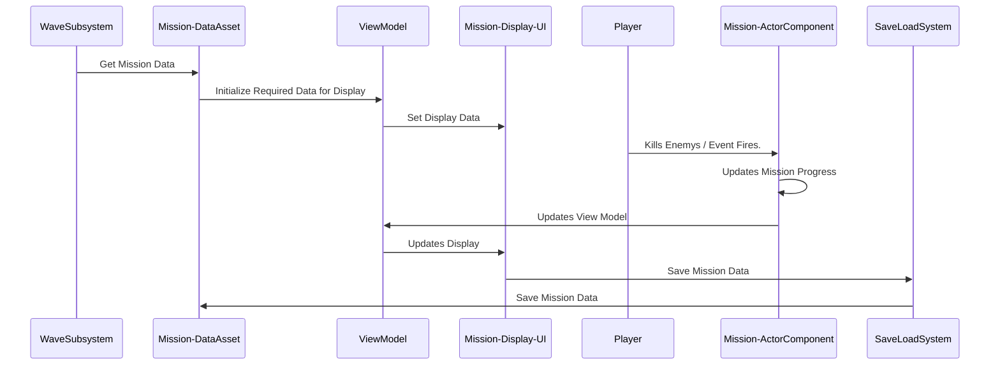

```mermaid

flowchart TD
    A(MissionComponent) -->|Actor Component| B(Player Character)
    C[Data Asset] --> D[Holds Mission Data.]
    E(View Model Class) --> |Holds Data to be Used by UI| F(W/WBPMission Display)
```




```mermaid
classDiagram
    MissionDataAsset 
    
```