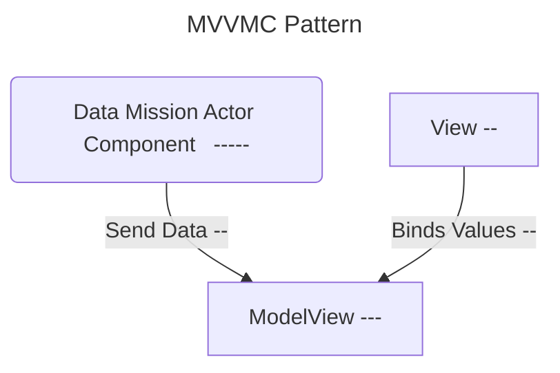

## Required Classes
### MissionDataAsset - UDataAsset
  - Title - Destroy the Enemy
  - Description - Destroys X Carbonites.
  - Progress - float %
    - UI Progress Bar.
  - Rewards
    - 20 Parts - 10 Mechanism
  - Events Tag
    - Combat.Destroy
  - Context Tags
    - Enemy.Carbonite
  - Event Based Context
    - Destroy
      - int Count (How Many To Destroy)
      - FGameplayTag Weapon.Melle
        - What Type of Weapon to look for in the Context Tags.
        
### Mission List Data Asset
    - List of MissionDataAssets
    - Can be packaged for certain setups
        - Ex. Tutorials, Standard, End Game, Endless

### MissionViewModel
  - Structured Data for Display/Mission UI
  - UI Binds to this Class.
  - FText Title
  - FText Description
  - FText Progress
  - Float Progress
  - This is bound directly to from the Widgets that need it in BP's
    - Ex. MissionDisplayUI
### MissionDisplayUI
  - Displays Current Mission Goals and Progress
  - Display
    - Title
    - Brief Description
      - Context Dependent
      - Destroy 10 Carbonites with a Melee Weapon 
        - Count
        - Enemy Type
        - Weapon Type
    - Progress Bar
    - Rewards
### MissionActorComponent
  - Handles Logic for Mission Progress.
  - Updates Mission View Model.
  - Binds to CombatEventsSubsystem
    - CES Broadcasts at Every Damage Dealing Combat event with Payload.
    - Payload
      - Instigator
      - Target
      - Amount
      - ContextTags
        - Weapon
        - Damaged vs Destroyed.
  - Binds to BuildEventsSubsystem
    - BES Broadcasts at Every Build Event
  - Gets Called at Start of Game
  - Assigns Current Mission

### CombatEventsSubsystem & BuildEventsSubsystem
  - Gets Called after Every Combat Event or Build Event with Payload
  - PublishDamageEvent
  - PublishKillEvent
  - Uses Payload to Broadcast Relevant Data back to the MissionActorComponent

### SaveLoadSystem
  - Saves Overall Mission Status
  - Tracks Missions Completed 
  

