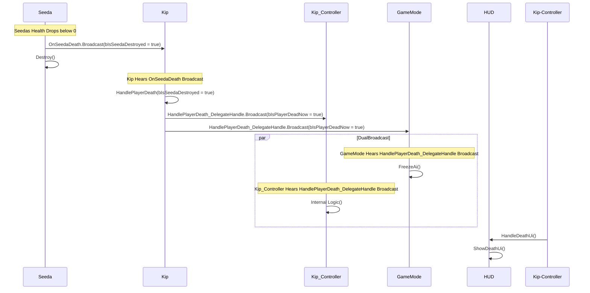
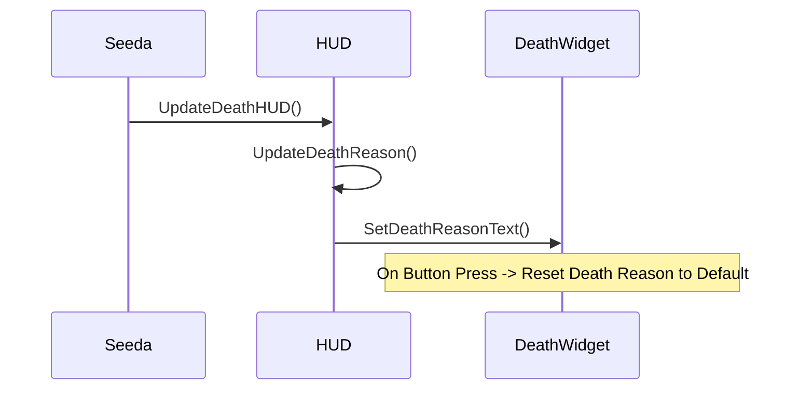


# Seeda Death
Description: The process that happens when Seeda is destroyed through the Death UI Screen showing to the player.
## Seeda Death Process

```mermaid
sequenceDiagram
    participant Seeda
    participant Kip
    participant Kip_Controller
    participant GameMode
    participant HUD
    
    note over Seeda: Seedas Health Drops below 0
    Seeda->>Kip: OnSeedaDeath.Broadcast(bIsSeedaDestroyed = true)
    Seeda->>Seeda: Destroy();
    note over Kip: Kip Hears OnSeedaDeath Broadcast
    Kip->>Kip: HandlePlayerDeath(bIsSeedaDestroyed = true)
    Kip->>Kip_Controller: HandlePlayerDeath_DelegateHandle.Broadcast(bIsPlayerDeadNow = true)
    Kip->>GameMode: HandlePlayerDeath_DelegateHandle.Broadcast(bIsPlayerDeadNow = true)
    par DualBroadcast 
    note over GameMode: GameMode Hears HandlePlayerDeath_DelegateHandle Broadcast
    GameMode->>GameMode: FreezeAi()
    note over Kip_Controller: Kip_Controller Hears HandlePlayerDeath_DelegateHandle Broadcast
    Kip_Controller->>Kip_Controller: Internal Logic()
    end
    Kip-Controller->>HUD: HandleDeathUi()
    HUD->>HUD: ShowDeathUi()

```
# HUD Data Update

```mermaid
sequenceDiagram
    participant Seeda
    participant HUD
    participant DeathWidget
    
    Seeda->>HUD: UpdateDeathHUD()
    HUD->>HUD: UpdateDeathReason()
    HUD->>DeathWidget: SetDeathReasonText()
    note over DeathWidget: On Button Press -> Reset Death Reason to Default
    
    

```