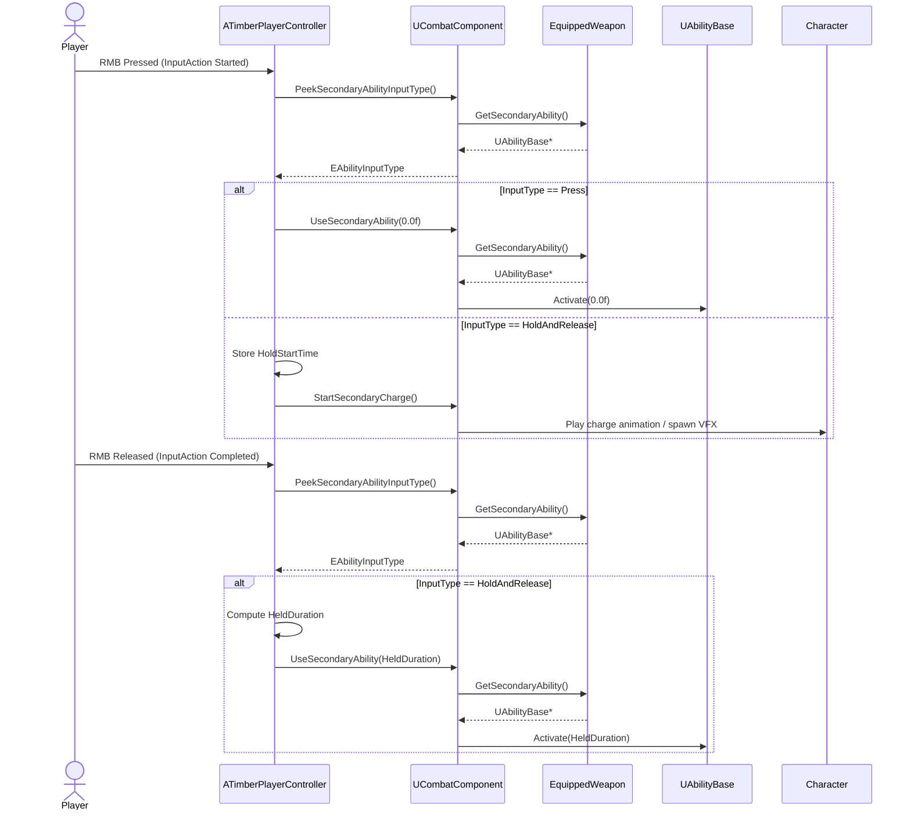

# Charged Input
Description: Shows Input flow for Charged Inputs on a Multi-Input Action Input.

```mermaid
sequenceDiagram
    actor Player
    participant Controller as ATimberPlayerController
    participant Combat as UCombatComponent
    participant Weapon as EquippedWeapon
    participant Ability as UAbilityBase

    Player->>Controller: RMB Pressed (InputAction Started)
    Controller->>Combat: PeekSecondaryAbilityInputType()
    Combat->>Weapon: GetSecondaryAbility()
    Weapon-->>Combat: UAbilityBase*
    Combat-->>Controller: EAbilityInputType

    alt InputType == Press
        Controller->>Combat: UseSecondaryAbility(0.0f)
        Combat->>Weapon: GetSecondaryAbility()
        Weapon-->>Combat: UAbilityBase*
        Combat->>Ability: Activate(0.0f)
    else InputType == HoldAndRelease
        Controller->>Controller: Store HoldStartTime
        Controller->>Combat: StartSecondaryCharge()
        Combat->>Character: Play charge animation / spawn VFX
    end

    Player->>Controller: RMB Released (InputAction Completed)
    Controller->>Combat: PeekSecondaryAbilityInputType()
    Combat->>Weapon: GetSecondaryAbility()
    Weapon-->>Combat: UAbilityBase*
    Combat-->>Controller: EAbilityInputType

    alt InputType == HoldAndRelease
        Controller->>Controller: Compute HeldDuration
        Controller->>Combat: UseSecondaryAbility(HeldDuration)
        Combat->>Weapon: GetSecondaryAbility()
        Weapon-->>Combat: UAbilityBase*
        Combat->>Ability: Activate(HeldDuration)
    end

```