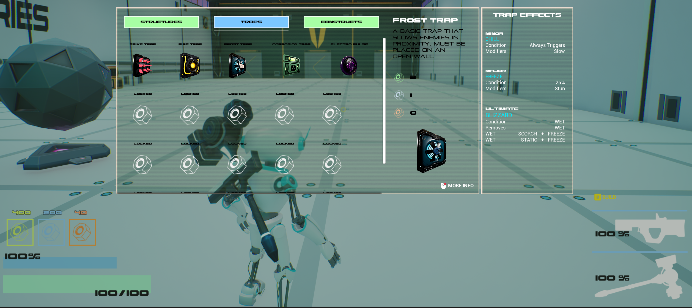
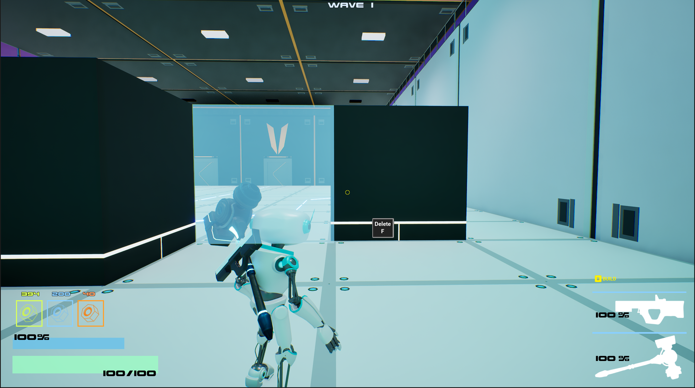
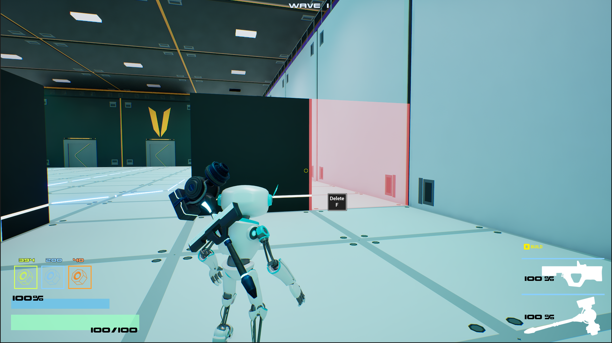
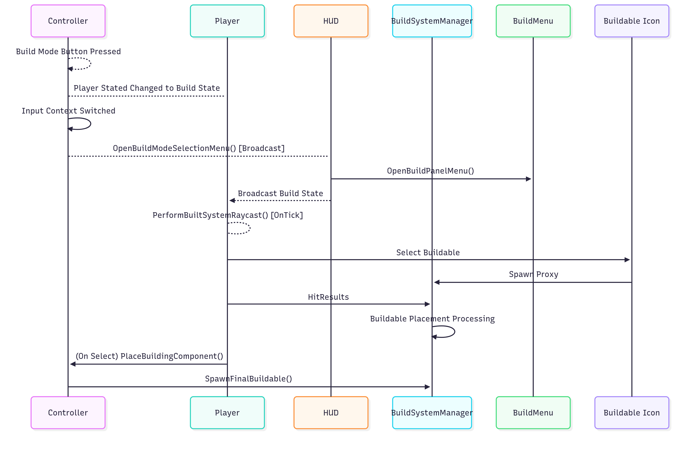

# Build System

## Build System Goals
1. Snap Walls and Floors Together.
2. Snap Components to Walls and Floors.
3. Snap Traps to Walls and Floors.
4. Save and Load Buildables.
5. Payment, Refunding, Deletion of buildables.
6. Incorrect Placement visual representation.

## Why this works
1. There is a lot of logic required to make different buildable types snap together. Encompassing it all in a single actor component gives better seperation of concers.
2. The Controller simply calls input events that the Build System Manager handles.
3. The HUD, Build Menu Panel, and Build Icons give a clear way for the player to interact with the build system.

## In Game Screenshots

### Build Menu

### Build Placement

### Invalid Build Placement

##  Key Features
- Walls and Floors Snap Together via a Quadrant & Snap Point System.
- Traps, Constructs and Structures snap to Walls and Floors, utilizing open "Slots" & "Snap Points" .
- Save and Load using GUID's to spawn the same buildable at load.
- Payment, Refunding, Deletion of buildables.
- Placement visual representation.

---

##  Code Map

<!-- blank line above! -->

| Class                                            | Role                                                                                            | Key Methods                                                                                                   | GitHub                                                                                                                                                                                                                                                                         |
|--------------------------------------------------|-------------------------------------------------------------------------------------------------|---------------------------------------------------------------------------------------------------------------|--------------------------------------------------------------------------------------------------------------------------------------------------------------------------------------------------------------------------------------------------------------------------------|
| `UBuildSystemManagerComponent` (Actor Component) | Handles Spawning, Placement and Snapping of all Buildables. (Structures, Components, Traps)     | `SpawnFinalBuildable()`, `SpawnProxy()`, `FirstHitBuildingComponentHitResult()`,`HandleProxyPlacement()`      | [H](https://github.com/unrealrobin/timbermvp/blob/main/Source/timbermvp/Public/Components/BuildSystem/BuildSystemManagerComponent.h) - [CPP](https://github.com/unrealrobin/timbermvp/blob/main/Source/timbermvp/Private/Components/BuildSystem/BuildSystemManagerComponent.cpp) |
| `ABuildableBase` (Actor)                         | Base class for any buildable class.                                                             |                                                                                                               | [H](https://github.com/unrealrobin/timbermvp/blob/main/Source/timbermvp/Public/BuildSystem/BuildableBase.h) - [CPP](https://github.com/unrealrobin/timbermvp/blob/main/Source/timbermvp/Private/BuildSystem/BuildableBase.cpp)                                                 |
| `UBuildingComponentPanel` (UI)                   | The UI for selecting a Buildable to Place and get all Buildable info, like synergies and costs. | `LoadAllDataAssetsForMenu()`, `CreateBuildableIconsInMenu()`, `PrepareTrapEffectList()`                       | [H](https://github.com/unrealrobin/timbermvp/blob/main/Source/timbermvp/Public/UI/BuildingComponentPanel.h) - [CPP](https://github.com/unrealrobin/timbermvp/blob/main/Source/timbermvp/Private/UI/BuildingComponentPanel.cpp)                                                 |
| `USaveLoadSubsystem`  (Game Instance Subsystem)  | Saves and Load Data.                                                                            | `SaveBuildableData(USaveLoadStruct* SaveGameInstance)`,`LoadBuildableData(USaveLoadStruct* LoadGameInstance)` | [H](https://github.com/unrealrobin/timbermvp/blob/main/Source/timbermvp/Public/Subsystems/SaveLoad/SaveLoadSubsystem.h) - [CPP](https://github.com/unrealrobin/timbermvp/blob/main/Source/timbermvp/Private/Subsystems/SaveLoad/SaveLoadSubsystem.cpp)                         |
| `UBuildingComponent`  (UI)                       | The UI for selecting a Buildable to Place and get all Buildable info, like synergies and costs. | **Functions In Blueprint**                                                                                    | [H](https://github.com/unrealrobin/timbermvp/blob/main/Source/timbermvp/Public/UI/BuildingComponent.h)                                                          |
| `UBuildComponentDataAsset`  (DA)                 | Data Asset used for Loading specific buildable information into the Building Component Panel.   |                                                                                                               | [H](https://github.com/unrealrobin/timbermvp/blob/main/Source/timbermvp/Public/Data/DataAssets/BuildComponentDataAsset.h)                                                                                                                                                                                                           |

---

## Build System Sequence

The build system includes multiple components needed to generate a build in game. The player enters build mode, selects a buildable from the build menu, spawns the proxy,
which is simply a representation of the buildable, and then if possible, spawns the final buildable. The build menu is populated
at the games initialization using Data Assets for each buildable type. The Data Assets comprise all the information about buildable cost and name
and are stored in their respective icons in the build menu.