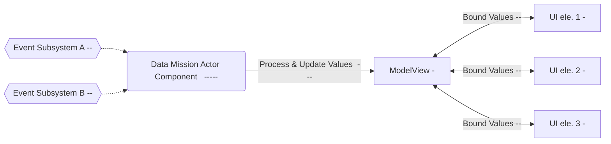
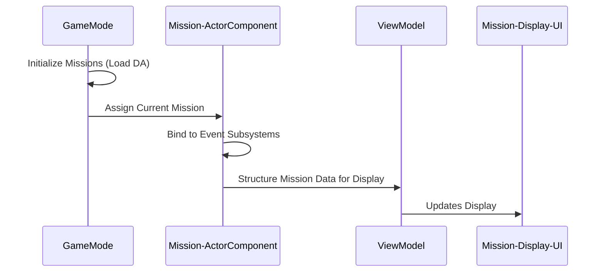
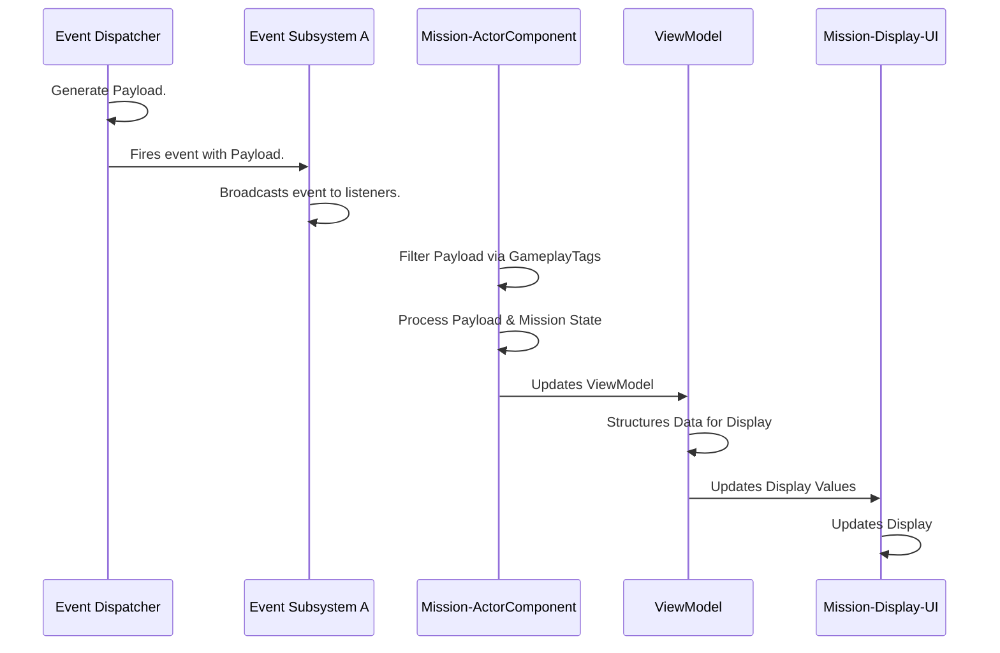
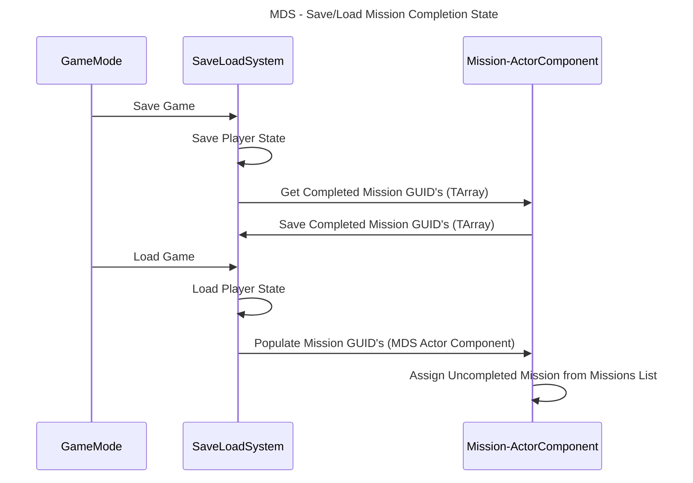

# Mission System Code Map

## Mission System Goals
1. Simplicity.
   2. Extendable to other systems. (Ex. Achievements, Tutotirals)
   3. Mission Design should be as simple as possible & require no code.
3. Dynamic.
   4. Mission Lists should be able to be changed at runtime.
5. Light Weight.

## Why this works
The MVVMC (Model View ViewModel Component) pattern is used to more easily share data between gameplay and UI. Multiple UI components can all bind to the same View Model without neededing to know how or when the dats is updated or evaluated. The View Model
is the single source of truth for all the "Views" that bind to it. This is a highly flexible and scalable design. For instance, you can have multiple UI views that show data in a different form that all get updated when the View Model is updated.

## Code Map
| Class                                         | Role                                                           | Key Methods                                                                         | Jump                                                                                                                                                                       |
|-----------------------------------------------|----------------------------------------------------------------|-------------------------------------------------------------------------------------|----------------------------------------------------------------------------------------------------------------------------------------------------------------------------|
| `UMissionDeliveryComponent` (Actor Component) | Owns mission state and handles mission filtering/processing.   | `InitializeActiveMission`, `SetActiveMission`, `CheckMissionContext`, `HandleEvent` | [H](Source/timbermvp/Public/Components/MissionDelivery/MissionDeliveryComponent.h)·[CPP](Source/timbermvp/Private/Components/MissionDelivery/MissionDeliveryComponent.cpp) |
| `UMissionViewModel` (View Model)              | Single Source of Truth for Mission Data. UI Facing.            |                                                                                     | [H](Source/timbermvp/Public/ViewModels/MissionViewModel.h)·[CPP](Source/timbermvp/Private/ViewModels/MissionViewModel.cpp)                                                                                                       |
| `UCombatEventSubsystem` (Game Subsystem)      | Broadcasts Payload to MDC Actor Component                      | `BroadcastCombatEvent`                                                              | [H](Source/timbermvp/Public/Subsystems/Events/CombatEventSubsystem.h)·[CPP](Source/timbermvp/Private/Subsystems/Events/CombatEventSubsystem.cpp)                                                                                                    |
| `UBuildEventSubsystem` (Game Subsystem)       | Broadcasts Payload to MDC Actor Component                      | `BroadcastBuildEvent`                                                               | [H](Source/timbermvp/Public/Subsystems/Events/BuildEventSubsystem.h)·[CPP](Source/timbermvp/Private/Subsystems/Events/BuildEventSubsystem.cpp)                                                                                                      |
| `UMissionList` (Data Asset)                   | Stores a set of Missions. Lives in UMissiongDeliveryComponent. |                                                                                     | [H](Source/timbermvp/Public/Data/DataAssets/MissionSystem/MissionList.h)                                                                                                   |
| `UMissionBase` (Data Asset)                   | Data + state for one mission                                   |                                                                                     | [H](Source/timbermvp/Public/Data/DataAssets/MissionSystem/MissionBase.h)                                                                                                   |

# Architecture Diagrams

### Pattern Overview

### Mission Delivery System Initialization

### Example Damage Event Pipeline

### Save/Load Mission State

## Required Classes
### MissionDataAsset - UDataAsset
  - Title - Destroy the Enemy
  - Description - Destroys X Carbonites.
  - Progress - float %
    - UI Progress Bar.
  - Rewards
    - 20 Parts - 10 Mechanism
  - Events Tag
    - Combat.Destroy
  - Context Tags
    - Enemy.Carbonite
  - Event Based Context
    - Destroy
      - int Count (How Many To Destroy)
      - FGameplayTag Weapon.Melle
        - What Type of Weapon to look for in the Context Tags.
  - Has a Specific GUID used for Player Saving/Progress.
        
### Mission List Data Asset
- List of MissionDataAssets
- Can be packaged for certain setups
    - Ex. Tutorials, Standard, End Game, Endless

### MissionViewModel
  - Structured Data for Display/Mission UI
  - UI Binds to this Class.
  - FText Title
  - FText Description
  - FText Progress
  - Float Progress
  - This is bound directly to from the Widgets that need it in BP's
    - Ex. MissionDisplayUI
    - 
### MissionDisplayUI
  - Displays Current Mission Goals and Progress
  - Display
    - Title
    - Brief Description
      - Context Dependent
      - Destroy 10 Carbonites with a Melee Weapon 
        - Count
        - Enemy Type
        - Weapon Type
    - Progress Bar
    - Rewards
    
### MissionActorComponent
  - Handles Logic for Mission Progress.
  - Updates Mission View Model.
  - Binds to CombatEventsSubsystem
    - CES Broadcasts at Every Damage Dealing Combat event with Payload.
    - Payload
      - Instigator
      - Target
      - Amount
      - ContextTags
        - Weapon
        - Damaged vs Destroyed.
  - Binds to BuildEventsSubsystem
    - BES Broadcasts at Every Build Event
  - Gets Called at Start of Game
  - Assigns Current Mission

### CombatEventsSubsystem & BuildEventsSubsystem
  - Gets Called after Every Combat Event or Build Event with Payload
  - PublishDamageEvent
  - PublishKillEvent
  - Uses Payload to Broadcast Relevant Data back to the MissionActorComponent

### SaveLoadSystem
  - Saves Overall Mission Status
  - Tracks Missions Completed 

### Objective Display
- Destroy [10] Carbonites
- Destroy [10] Carbonites with [Hammer]
- Destroy [10] Carbonites with [Rifle]
- Destroy [10] Carbonites with [Traps]
- Destroy [10] [Grunts] with [Traps]
- Destroy [10] [Brutes] with [Rifle]
- Build [3] [Structures]
- Build [3] [Components]
- Build [3] [Traps]
- Defeat Wave with only [Trap]
- Ensure the Data Seed Takes 0 Damage for [1] Wave

- Objectives should be able to Stack. IE, multiple objects per mission.

## 🔗 Links
- [View Code on GitHub](https://github.com/robinnnnnn/timbermvp)
- [Return to Main Project Repo](https://github.com/yourname/yourrepo)
