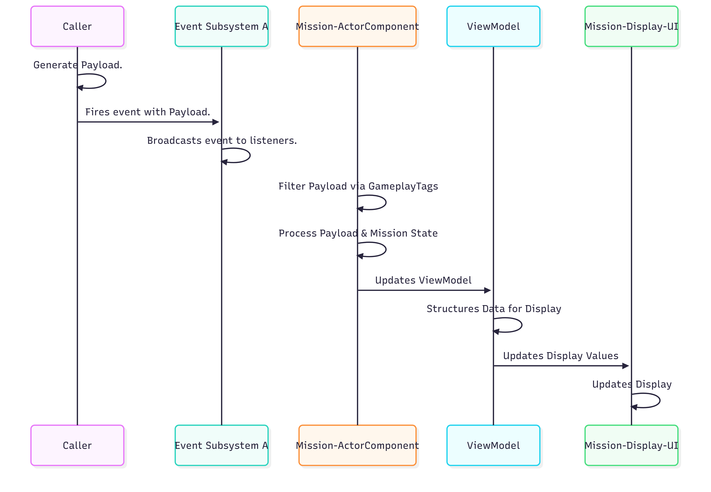
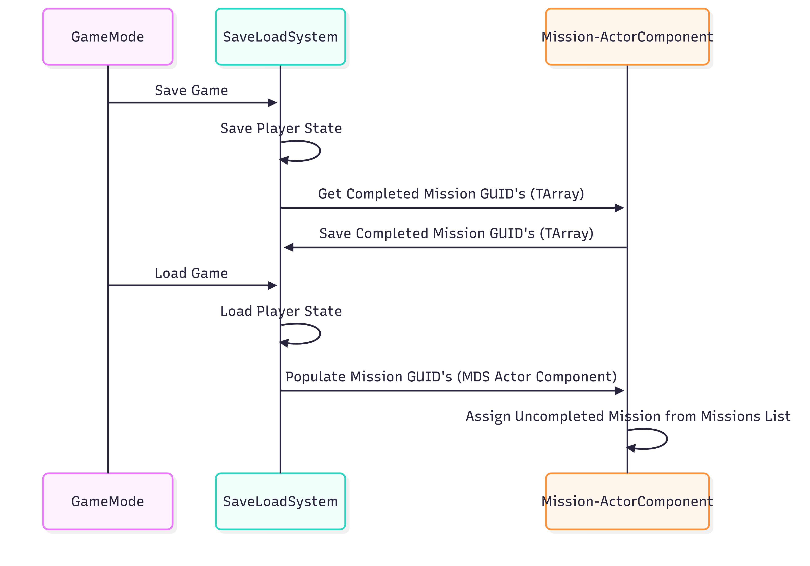

# Mission System

## Goals
1. Simplicity.
- Extendable to other systems. (Ex. Achievements, Tutorials)
- Mission Design should be as simple as possible & require low/no code.
2. Dynamic
- Mission Lists can be changed at runtime.
3. Lightweight.
- Avoid a bloated system tightly couples across the codebase.

## Why this works
The MVVM-C (Model–View–ViewModel–Component) pattern enables data sharing between gameplay and UI without the UI knowing about gameplay implementation.  
Multiple UI components can bind to the same ViewModel without needing to know how or when data is updated. The ViewModel is the single source of truth for all bound Views.  
For example, multiple UI views can present the same mission data differently and all update automatically when the ViewModel changes.  
A single subsystem that broadcasts events with a payload reduces coupling between systems.

## In Game Screenshot

## Code Map
<!-- blank line above! -->

| Class                                   | Role                                                     | Key Methods                                                                                                            | Github                                                                                                                                                                                                                                                                             |
|-----------------------------------------|----------------------------------------------------------|------------------------------------------------------------------------------------------------------------------------|------------------------------------------------------------------------------------------------------------------------------------------------------------------------------------------------------------------------------------------------------------------------------------|
|`UMissionDeliveryComponent` (Actor Component) |Owns mission state and handles mission filtering/processing. | `InitializeActiveMission`, `SetActiveMission`, `CheckMissionContext`, `HandleEvent`                                    | [H](https://github.com/unrealrobin/timbermvp/blob/main/Source/timbermvp/Public/Components/MissionDelivery/MissionDeliveryComponent.h) - [CPP](https://github.com/unrealrobin/timbermvp/blob/main/Source/timbermvp/Private/Components/MissionDelivery/MissionDeliveryComponent.cpp) |
|`UMissionViewModel` (View Model)         |Single Source of Truth for Mission Data. UI Facing.       | **Getters & Setters with Broadcast Macros**, `UE_MVVM_SET_PROPERTY_VALUE()`, `UE_MVVM_BROADCAST_FIELD_VALUE_CHANGED()` | [H](https://github.com/unrealrobin/timbermvp/blob/main/Source/timbermvp/Public/ViewModels/MissionViewModel.h) - [CPP](https://github.com/unrealrobin/timbermvp/blob/main/Source/timbermvp/Private/ViewModels/MissionViewModel.cpp)                                                 |
|`UMissionEventSubsystem` (Game Subsystem) |Broadcasts Payload to MDC Actor Component                 | `BroadcastMissionEvent()`                                                                                              | [H](https://github.com/unrealrobin/timbermvp/blob/main/Source/timbermvp/Public/Subsystems/Events/MissionEventSubsystem.h) - [CPP](https://github.com/unrealrobin/timbermvp/blob/main/Source/timbermvp/Private/Subsystems/Events/MissionEventSubsystem.cpp)                         |
|`UMissionList` (Data Asset)              |Stores a set of Missions. Lives in UMissiongDeliveryComponent. | ** No Logic in Data Asset **                                                                                           | [H](https://github.com/unrealrobin/timbermvp/blob/main/Source/timbermvp/Public/Data/DataAssets/MissionSystem/MissionList.h)                                                                                                                                                        |
|`UMissionBase` (Data Asset)              |Data + state for one mission                              | ** No Logic in Data Asset **                                                                                           | [H](https://github.com/unrealrobin/timbermvp/blob/main/Source/timbermvp/Public/Data/DataAssets/MissionSystem/MissionBase.h)                                                                                                                                                        |
|`UMissionDisplayWidget` (View/UI)        |Displays Data / Handles Animations and Visuals            | ** Functions in Blueprint **                                                                                           | [H](https://github.com/unrealrobin/timbermvp/blob/main/Source/timbermvp/Public/UI/MissionSystem/MissionDisplayWidget.h)                                                                                                                                                            |

## Key Features
1. Event-driven mission system.
2. Easy mission authoring in-editor via Data Assets.
3. Gameplay Tags used for mission design and event filtering.
4. ViewModel data can be reused outside the mission UI.
5. Low coupling by interacting through the ViewModel and event subsystems.

# Mission System Architecture
### Pattern Overview

The MVVM-C pattern (Model–View–ViewModel–Component) is a simple, unidirectional data-binding approach. 
Multiple gameplay systems can reference the Mission Event Subsystem and call its broadcast function to send events to the Mission Delivery Component (MDC). 
The MDC validates each event’s context and pushes updates to the ViewModel. The ViewModel then structures mission data for the UI. 
Any number of UI widgets can bind to the ViewModel and automatically receive the latest mission data.

### Mission Delivery System Initialization

The mission Actor Component binds to the relevant subsystems on startup. 
When a new mission is set, it populates the ViewModel with fresh mission data (for example: title, description, objectives, and rewards) so the UI can present the current mission state immediately.

### Example Damage Event Pipeline

As an example, consider a mission to deal X damage to enemies. When an enemy takes damage, a mission event payload is created and sent to the Mission Event Subsystem. 
The subsystem broadcasts the event to the MDC, which validates the payload using context Gameplay Tags. If the context is valid, the MDC updates progress, checks for completion, and then forwards the latest state to the ViewModel. 
The ViewModel structures the data for easy UI consumption, and the UI updates automatically via MVVM bindings.

### Save/Load Mission State

Completed missions are tracked and saved using mission GUIDs. On save, the MDC’s completed mission list is persisted. 
On load, the MDC repopulates its completed missions from those GUIDs to restore the player’s mission progress.

## 🔗 Links
- [View Full Repo on GitHub](https://github.com/unrealrobin/timbermvp)
