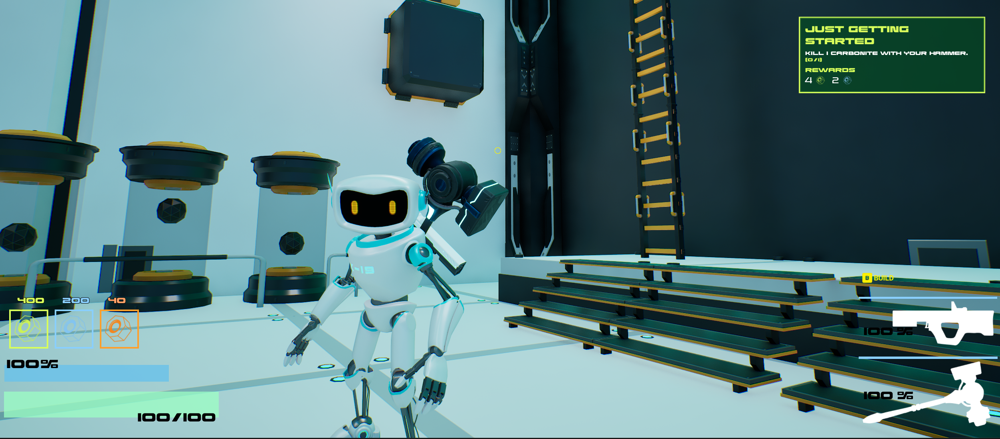

# Mission System

## Goals
1. Simplicity.
- Extendable to other systems. (Ex. Achievements, Tutorials)
- Mission Design should be as simple as possible & require low/no code.
2. Dynamic
- Mission Lists should be able to be changed at runtime.
3. Light Weight.
- Not to be a bloated mess with tentacles crawling through-out the code.

## Why this works
The MVVMC (Model View ViewModel Component) pattern is used to more easily share data between gameplay and UI without needing the UI to know anything about gameplay. 
Multiple UI components can all bind to the same View Model without neededing to know how or when the data is updated or evaluated. 
The View Model is the single source of truth for all the "Views" that bind to it. 
For instance, you can have multiple UI views that show data in a different form that all get updated when the View Model is updated.
Having a single subsystem that only broadcasts events with a Payload ensures there is low coupling between the different classes.

## In Game Screenshot

## Code Map
<!-- blank line above! -->

| Class                                   | Role                                                     | Key Methods                                                                                                            | Github                                                                                                                                                                                                                                                                            |
|-----------------------------------------|----------------------------------------------------------|------------------------------------------------------------------------------------------------------------------------|-----------------------------------------------------------------------------------------------------------------------------------------------------------------------------------------------------------------------------------------------------------------------------------|
|`UMissionDeliveryComponent` (Actor Component) |Owns mission state and handles mission filtering/processing. | `InitializeActiveMission`, `SetActiveMission`, `CheckMissionContext`, `HandleEvent`                                    | [H](https://github.com/unrealrobin/timbermvp/blob/main/Source/timbermvp/Public/Components/MissionDelivery/MissionDeliveryComponent.h) - [CPP](https://github.com/robinnnnnn/timbermvp/blob/main/Source/timbermvp/Private/Components/MissionDelivery/MissionDeliveryComponent.cpp) |
|`UMissionViewModel` (View Model)         |Single Source of Truth for Mission Data. UI Facing.       | **Getters & Setters with Broadcast Macros**, `UE_MVVM_SET_PROPERTY_VALUE()`, `UE_MVVM_BROADCAST_FIELD_VALUE_CHANGED()` | [H](https://github.com/unrealrobin/timbermvp/blob/main/Source/timbermvp/Public/ViewModels/MissionViewModel.h) - [CPP](https://github.com/unrealrobin/timbermvp/blob/main/Source/timbermvp/Private/ViewModels/MissionViewModel.cpp)                                                |
|`UMissionEventSubsystem` (Game Subsystem) |Broadcasts Payload to MDC Actor Component                 | `BroadcastMissionEvent()`                                                                                              | [H](https://github.com/unrealrobin/timbermvp/blob/main/Source/timbermvp/Public/Subsystems/Events/MissionEventSubsystem.h) - [CPP](https://github.com/unrealrobin/timbermvp/blob/main/Source/timbermvp/Private/Subsystems/Events/MissionEventSubsystem.cpp)                        |
|`UMissionList` (Data Asset)              |Stores a set of Missions. Lives in UMissiongDeliveryComponent. | ** No Logic in Data Asset **                                                                                           | [H](https://github.com/unrealrobin/timbermvp/blob/main/Source/timbermvp/Public/Data/DataAssets/MissionSystem/MissionList.h)                                                                                                                                                       |
|`UMissionBase` (Data Asset)              |Data + state for one mission                              | ** No Logic in Data Asset **                                                                                           | [H](https://github.com/unrealrobin/timbermvp/blob/main/Source/timbermvp/Public/Data/DataAssets/MissionSystem/MissionBase.h)                                                                                                                                                       |
|`UMissionDisplayWidget` (View/UI)        |Displays Data / Handles Animations and Visuals            | ** Functions in Blueprint **                                                                                           | [H](https://github.com/unrealrobin/timbermvp/blob/main/Source/timbermvp/Public/UI/MissionSystem/MissionDisplayWidget.h)                                                                                                                                                           |

## Key Features
1. Event Driven Mission System.
2. Easy Mission Design via in editor Data Assets.
2. Gameplay Tags are used for both mission design and event filtering.
3. View Model Data can be used outside of the Mission UI.
4. Coupling only to the View Model and Event Subsystems.

# Mission System Architecture
### Pattern Overview

The MVVM-C Patter (Model View View Model Component) is a simply uni-directly data binding pattern. Many different systems can get a reference to the Event Subsystem and calls its broadcast
function in order to send events to the Mission Delivery Component. The mission delivery component only validates the context and pushes new data to the view model. The view model structures
the data in a way that is easy to use in the UI. Any number of UI components can bind to the view model and get the latest Mission Data.

### Mission Delivery System Initialization

The Mission Actor component Binds to the Subsystems on start up and when a new mission is set, populates the view model with new mission data.

### Example Damage Event Pipeline

In one example, the the mission is to do X damage to an enemy. In the enemies Take Damage function, a MissionEventPayload is created and sent to the Event Subsystem. 
The Event Subsystem then broadcasts the event to the Mission Delivery Component (MDC). The Mission Delivery Component then validates the payload via its Context Tags (Gameplay Tags). 
If all the required context tags are present, the MDC processes the data (checks if mission is complete) and then sends the new data to the view model.
The view model structures the data in a way that is easy to use in the UI, and the UI automatically gets any updates to the view model.

### Save/Load Mission State

Completed missions are saved via Mission GUID's. When a save occurs, the MDC's Completed Missions list is saved. During load, the MDC completed Missions array is
repopulated with the Completed Missions GUID's.

## 🔗 Links
- [View Full Repo on GitHub](https://github.com/unrealrobin/timbermvp)
