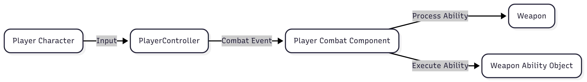
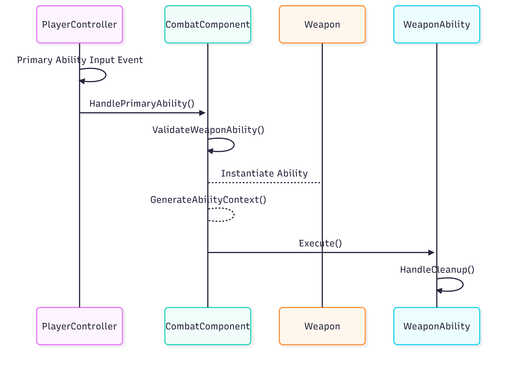

# Player Combat Ability System

## Goals
1. Encapsulate Ability Logic
- All ability logic lives in the ability.
- All VFX/Sounds/Animations are Encapsulated in the ability class.
2. Drag and Drop Actor Component
- Any Playable Character can have the Component added.
3. Dynamic Ability
- Abilities should be able to be swapped at runtime and upgraded.
---

## Why this works
The player combat system uses an Actor Component that manages the player’s abilities based on the currently equipped weapon.  
Each weapon owns encapsulated abilities that control their own behavior. Abilities can be swapped at runtime and are created by subclassing the `UWeaponAbilityBase` class.  
Each ability manages the lifetime of its instantiated object and cleans itself up when execution completes.

## Code Map
<!-- blank line above! -->

| Class                                 | Role                                                              | Key Methods                                                                                                 | GitHub                                                                                                                                                                                                                                                       |
|---------------------------------------|-------------------------------------------------------------------|-------------------------------------------------------------------------------------------------------------|--------------------------------------------------------------------------------------------------------------------------------------------------------------------------------------------------------------------------------------------------------------|
| `UCombatComponent` (Actor Component)  | Manages ability Cooldowns and Resources                           | `HandlePrimaryAbility()`, `HandleSecondaryAbility()`, `ValidateWeaponAbility()`, `GenerateAbilityContext()` | [H](https://github.com/unrealrobin/timbermvp/blob/main/Source/timbermvp/Public/Components/Combat/CombatComponent.h) - [CPP](https://github.com/unrealrobin/timbermvp/blob/main/Source/timbermvp/Private/Components/Combat/CombatComponent.cpp)               |
| `UWeaponAbilityBase` (Ability UObject) | Defines the abilities Logic.                                      | `Execute()`, `HandleCleanup()`                                                                              | [H](https://github.com/unrealrobin/timbermvp/blob/main/Source/timbermvp/Public/Weapons/Abilities/WeaponAbilityBase.h) - [CPP](https://github.com/unrealrobin/timbermvp/blob/main/Source/timbermvp/Private/Weapons/Abilities/WeaponAbilityBase.cpp)           |
| `UBasicSlash` (Melee Primary Ability) | The primary ability for a melee weapon. This ability has a Combo. | `Execute()`, `ResetComboData()`                                                                             | [H](https://github.com/unrealrobin/timbermvp/blob/main/Source/timbermvp/Public/Weapons/Abilities/MeleeWeapon/BasicSlash.h) - [CPP](https://github.com/unrealrobin/timbermvp/blob/main/Source/timbermvp/Private/Weapons/Abilities/MeleeWeapon/BasicSlash.cpp) |

---

## Key Features
- All Ability logic is encapsulated.
- Abilities are stored on the Weapon.
- The Combat Component is decoupled from ability internals and simply calls `Execute()`.
- Abilities communicate via a context payload passed to the Combat Component.

---
# System Architecture

## Pattern

The Combat Component is the entry point for all abilities. This is helpful by reducing the amount of process logic and evaluation that would have
otherwise been written in the ability, character class, or controller. Controllers route combat and weapon events to the Combat Component .

## Primary Ability Sequence

A base UObject class encapsulates the data and behavior for each ability. When an ability is requested:
1. It is validated first (availability, resources, cooldown).
2. If valid, the ability is instantiated and executed.
3. The ability cleans itself up after execution, removes its references from the Combat Component, and is garbage-collected.

## 🔗 Links
- [View Full Repo on GitHub](https://github.com/unrealrobin/timbermvp)