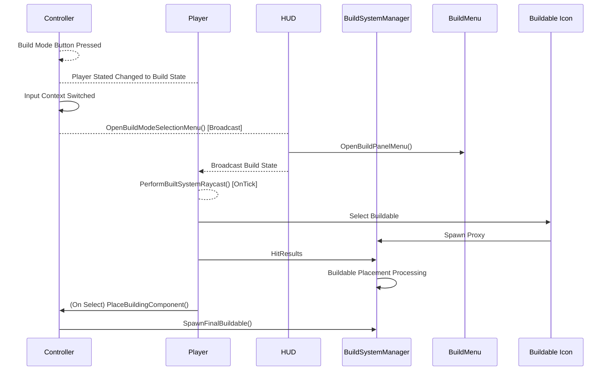

```mermaid
sequenceDiagram
    participant A as Controller
    participant B as Player
    participant C as HUD
    participant D as BuildSystemManager
    participant E as BuildMenu
    participant F as Buildable Icon

    A -->> A: Build Mode Button Pressed
    A --> B: Player Stated Changed to Build State
    A ->> A: Input Context Switched
    A --> C: OpenBuildModeSelectionMenu() [Broadcast]
    C ->> E: OpenBuildPanelMenu()
    C -->> B: Broadcast Build State
    B --> B: PerformBuiltSystemRaycast() [OnTick]
    B ->> F: Select Buildable
    F ->> D: Spawn Proxy
    B ->> D: HitResults
    D ->> D: Buildable Placement Processing
    B ->> A: (On Select) PlaceBuildingComponent()
    A ->> D: SpawnFinalBuildable()

```