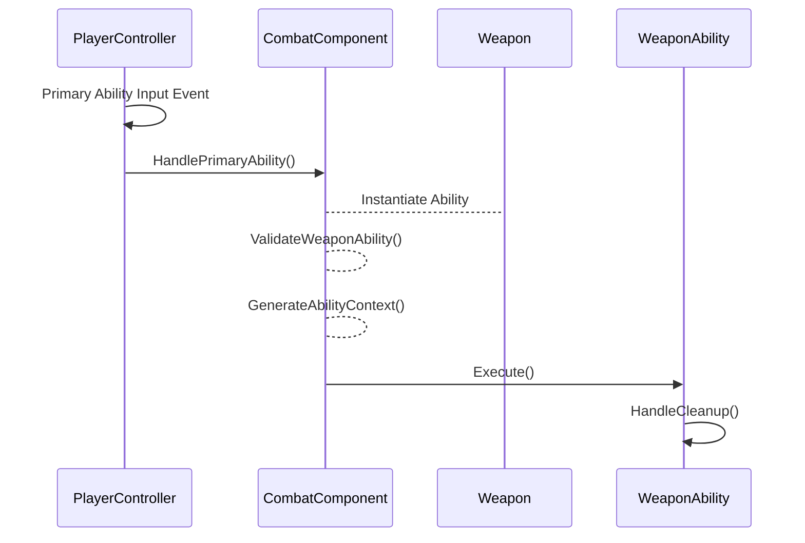

```mermaid
flowchart LR
    A(Player Combat Component)
    B(PlayerController)
    C(Weapon Ability Object)
    D(Player Character)
    E(Weapon)

    
    
    D --> |Player Input| B
    B --> |Combat Event|A
    A --> |Process Ability|E
    A --> |Execute Ability| C

```

