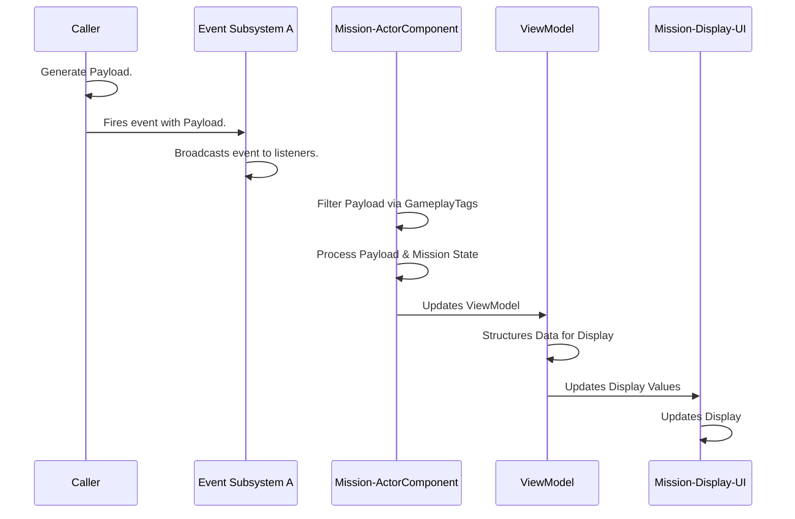
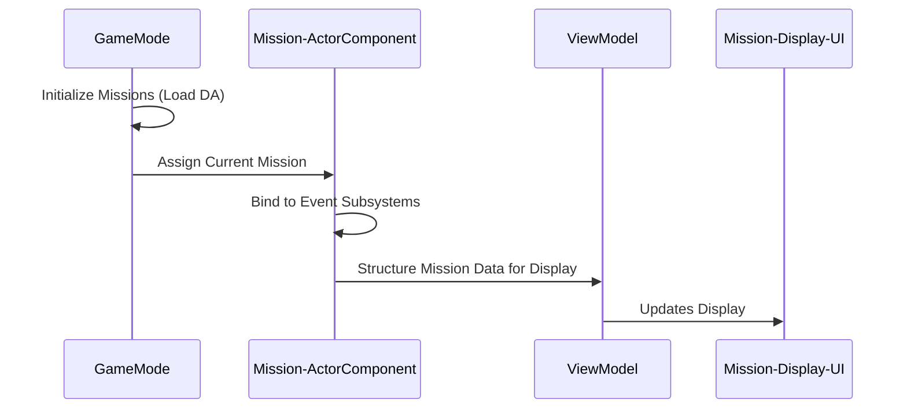
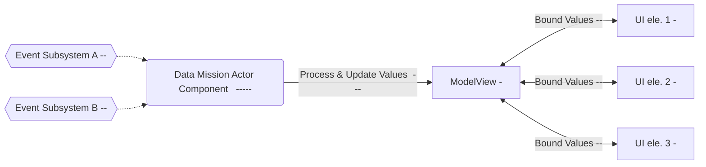

```mermaid
sequenceDiagram
    
participant A as GameMode
participant B as SaveLoadSystem
participant C as Mission-ActorComponent

A ->> B: Save Game
B ->> B: Save Player State
B ->> C: Get Completed Mission GUID's (TArray)
C ->> B: Save Completed Mission GUID's (TArray)

A ->> B: Load Game
B ->> B: Load Player State
B ->> C: Populate Mission GUID's (MDS Actor Component)
C ->> C: Assign Uncompleted Mission from Missions List
```




