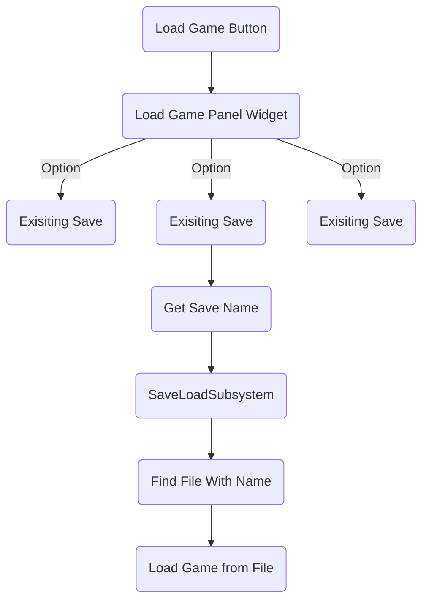
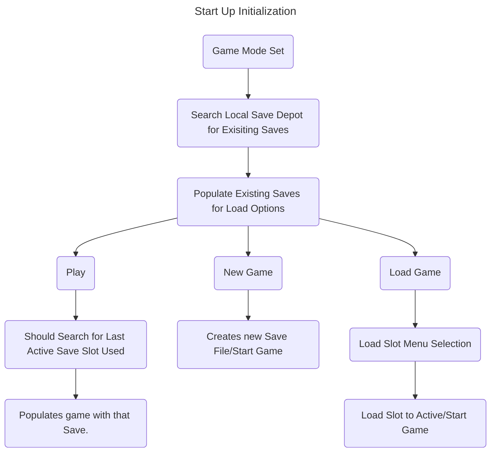

## Start Up Process
1. Player Starts the game and is presented with the Start Menu.
2. SaveLoad Susbsytem then checks whether or not there are exisiting saves installed locally for the game.
   3. YES? -> Menu appears as CONTINUE (Button) or NEW GAME (Button) or LOAD GAME(Button)
   4. No? -> Menu appears as NEW GAME (Button)

## New Game
1. If the player selects new game, a new game is selected with a Identifier (GUID?)
   2. Identifier will map to a specific file when loading this game.
2. SaveLoadSubsystem will then create the new SaveFile and then Start the New Game.
3. All new saves will be saved to the loaded save file.

## Load Game
1. If player selects Load Game, a `LoadGameMenuWidget` will popup and list out all exisiting saves installed locally for the game.
2. Selecting on of the options will then prompt the SaveLoadSubsystem to search for if the Save File exisitings.
3. If it does, the file will be loaded and then the game will start.
4. If it does not, there needs to be some kind of fall back.

# List of Requirements
6. Widgets
   8. LoadGameMenuWidget
   9. LoadGameSlotOptionWidget
10. SaveLoadSubsystem Logic Needs
    11. Search through the exisiting save files that are saved locally.
    12. Check the file name against the slots supplied name.