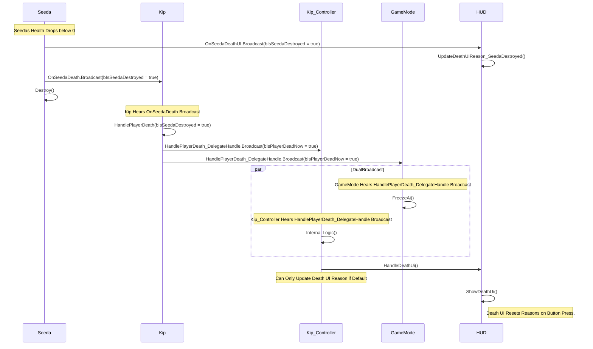


# Seeda Death
Description: This sequence describes how the game reacts when Seeda's health reaches zero, triggering player death logic, AI freeze, and the Death UI screen transition.
## Seeda Death Process

---
Note:
1. When the Data Seed (Seeda) dies, the play is also destroyed directly after. The player also tries to update the 
   death reason ui so we have a check to make sure it can only be set when its the default reason.