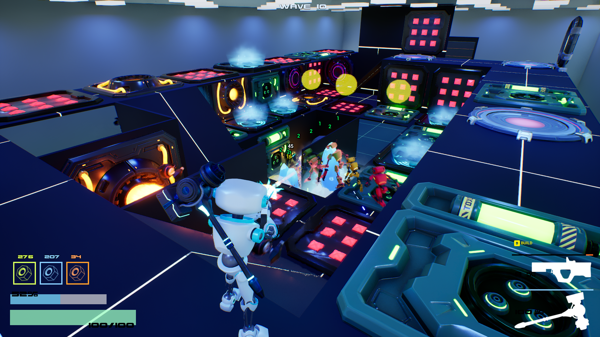

# Die Robot – Game Systems Portfolio

**Die Robot** is a 3rd-person tower-defense/action game I built solo in **Unreal Engine 5.4 (C++)**.  
Players defend a lab from waves of robots by building traps, chaining trap combos, and fighting directly with weapons and weapon abilities..

This portfolio highlights the **three core gameplay systems** I’m most proud of.

  <iframe width="560" height="315" src="https://www.youtube.com/embed/X6uwQZvJpAY?si=ATIWx7T0j73x_zbJ" title="YouTube video player" frameborder="0" allow="accelerometer; autoplay; clipboard-write; encrypted-media; gyroscope; picture-in-picture; web-share" referrerpolicy="strict-origin-when-cross-origin" allowfullscreen></iframe>

## You can try the Demo here -> [DEMO](https://drive.google.com/drive/folders/1hJQrmnM6F_LmO74WHoozdmP9ByduKGBU?usp=drive_link)

---

## 🎮 Game Overview
- **Genre:** Tower Defense + Action Combat
- **Engine:** Unreal Engine 5.4 (C++) (Updated to 5.6)
- **Team Size:** Solo Developer
- **Game Website:** [www.paracosm.gg](https://www.paracosm.gg)
- **Steam:** [Steam Page](https://store.steampowered.com/app/3704770/Die_Robot/)
- **Github:** [Github Repo](https://github.com/unrealrobin/timbermvp)

---

##  Featured Systems

### [Mission System](./Portfolio/MissionDeliverySystem.md)
A modular, data-driven quest framework, using the MVVM-C Pattern.
- Actor Component based manager.
- GameplayTags for event filtering & easy mission iteration.
- Uses Unreal Engine's MVVM View Model Pattern.'

---

### [Player Ability System](./Portfolio/PlayerCombatSystem.md)
A flexible weapon component that drives combat abilities..
- Energy-driven alt-fires and knockback.
- Encapsulated UObject based abilities.
- Scalable design for adding new ability types.

---

### [Build System](./Portfolio/BuildSystem.md)
Logic for placing, validating, and managing traps & structures.
- Placement rules (collision, grid, NavMesh integration).
- Dynamic Traps with Synergistic Effects. (fire + gas → explosion).
- Save & Load via GUID's and persistant parent-child relationships (Walls & Traps).

---

## Other Systems
 - Custom AI behavior and pathfinding.
 - Trap Synergy System.

##  About Me
I’m a gameplay programmer passionate about **system design and combat mechanics**.  
Looking for **gameplay engineering & technical design roles** in Unreal Engine projects.

- [LinkedIn](https://linkedin.com/in/robinlifshitz)
- [GitHub Repo](https://github.com/unrealrobin/timbermvp)

---

